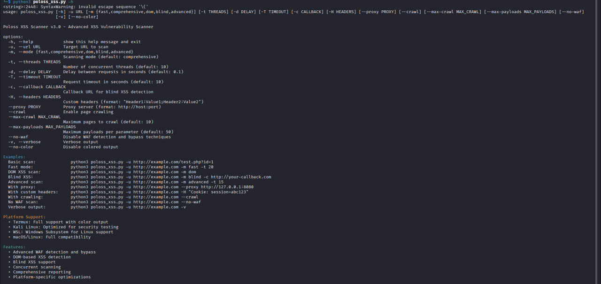
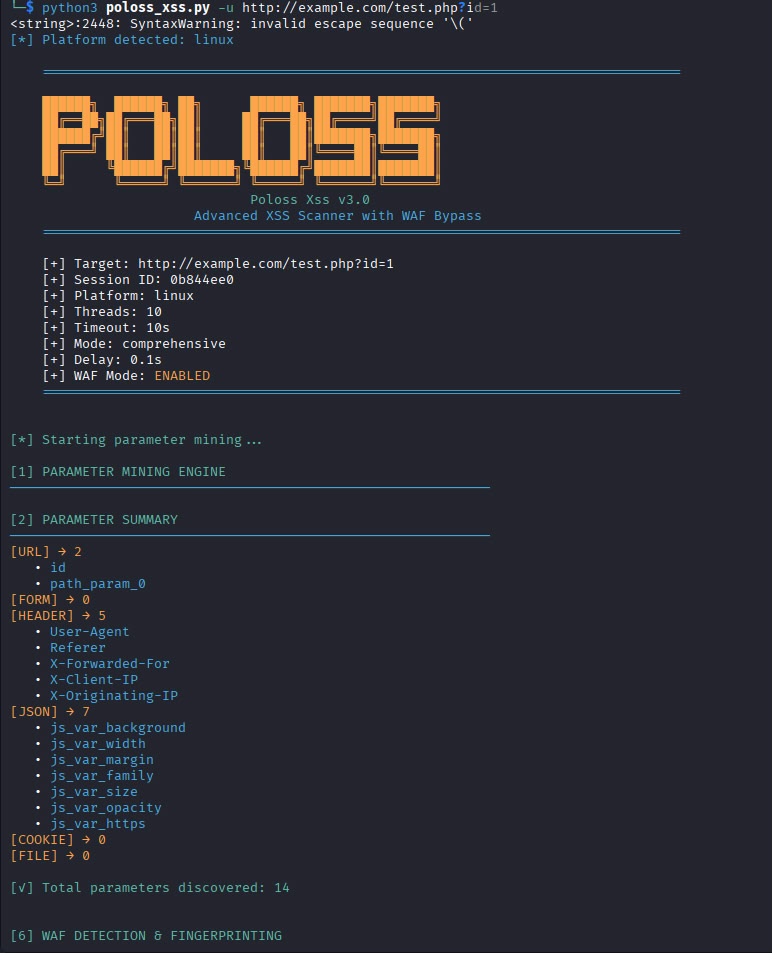

# Poloss XSS Scanner v3.0


<p align="center">
  
  
  
  
</p>

<p align="center">
  <strong>Advanced Cross-Site Scripting (XSS) Vulnerability Scanner with WAF Bypass</strong>
</p>

---

## 📸 Demo

### 🖼️ **Screenshot 1: Program Startup**

*Tampilan awal program dengan banner dan konfigurasi*

### 🖼️ **Screenshot 2: Contoh Scanning**

*Proses scanning dan deteksi kerentanan*

---

## 📋 Daftar Isi
- [✨ Fitur Utama](#-fitur-utama)
- [🚀 Instalasi](#-instalasi)
- [⚡ Penggunaan](#-penggunaan)
- [🎯 Mode Scanning](#-mode-scanning)
- [🔧 Opsi Lanjutan](#-opsi-lanjutan)
- [🛡️ WAF Bypass](#️-waf-bypass)
- [📊 Laporan](#-laporan)
- [📁 Struktur Proyek](#-struktur-proyek)
- [⚠️ Catatan Penting](#️-catatan-penting)
- [📄 Lisensi](#-lisensi)

---

## ✨ Fitur Utama

### 🔍 **Deteksi Komprehensif**
- **Parameter Mining** otomatis (URL, Form, Header, JSON, Cookies)
- **DOM-based XSS** detection dengan analisis JavaScript
- **Blind XSS** support dengan callback URL
- **Reflection Detection** cerdas di berbagai konteks

### 🛡️ **WAF Bypass Canggih**
- **Multi-WAF Detection** (Cloudflare, ModSecurity, AWS WAF, dll)
- **Smart Bypass Engine** dengan 1000+ payload variasi
- **Encoding Techniques**: HTML entities, URL encoding, Unicode, dll
- **No-WAF Mode** untuk testing internal

### ⚡ **Performance Optimized**
- **Concurrent Scanning** dengan thread pool
- **Platform Detection** (Termux, Kali Linux, WSL)
- **Rate Limiting** dengan delay yang bisa disesuaikan
- **Progress Tracking** real-time

### 📊 **Reporting Lengkap**
- **JSON & Text Reports** otomatis
- **Statistics & Metrics** detail
- **Exploit Examples** dengan payload
- **Recommendations** untuk remediation

---

## 🚀 Instalasi

### Prerequisites
- Python 3.7 atau lebih tinggi
- pip (Python package manager)

### Install Dependencies
```bash
# Clone repository
git clone https://github.com/O99099O/By-Poloss..-..XSS-Attack.git
cd By-Poloss..-..XSS-Attack

# Install requirements
pip install -r requirements.txt

# Atau install manual
pip install requests beautifulsoup4 colorama
```

### Platform Specific
```bash
# Termux (Android)
pkg install python git
pip install requests beautifulsoup4 colorama

# Kali Linux
sudo apt update
sudo apt install python3-pip
pip3 install requests beautifulsoup4 colorama

# WSL (Windows)
sudo apt update
sudo apt install python3 python3-pip
pip3 install requests beautifulsoup4 colorama
```

---

## ⚡ Penggunaan

### Basic Usage
```bash
python3 poloss_xss.py -u http://example.com/test.php?id=1
```

### Contoh Lengkap
```bash
# Scan komprehensif dengan crawling
python3 poloss_xss.py -u http://target.com -t 15 --crawl

# Mode cepat untuk testing awal
python3 poloss_xss.py -u http://target.com -m fast

# DOM XSS focused scan
python3 poloss_xss.py -u http://target.com -m dom

# Blind XSS dengan callback
python3 poloss_xss.py -u http://target.com -m blind -c http://your-server.com/log

# Advanced dengan WAF bypass
python3 poloss_xss.py -u http://target.com -m advanced -t 20

# No WAF mode (untuk testing internal)
python3 poloss_xss.py -u http://target.com --no-waf
```

---

## 🎯 Mode Scanning

| Mode | Deskripsi | Penggunaan |
|------|-----------|------------|
| **fast** | Scanning cepat, 20 parameter pertama | Testing awal, waktu terbatas |
| **comprehensive** | Scanning lengkap (default) | Testing menyeluruh |
| **dom** | Fokus DOM-based XSS | Single Page Applications |
| **blind** | Blind XSS dengan callback | Bug bounty, monitoring |
| **advanced** | Semua teknik + WAF bypass | Penetration testing |

---

## 🔧 Opsi Lanjutan

```bash
# Threads dan performance
-t, --threads        Threads (default: 10, Termux: 5)
-d, --delay          Delay antar request (default: 0.1s)
-T, --timeout        Request timeout (default: 10s)

# Crawling dan scope
--crawl              Enable page crawling
--max-crawl          Max pages to crawl (default: 10)
--max-payloads       Max payloads per parameter (default: 50)

# Customization
-H, --headers        Custom headers "Header:Value;Header2:Value2"
--proxy              Proxy server http://host:port
--no-color           Disable colored output
-v, --verbose        Verbose output

# WAF Control
--no-waf             Disable WAF detection and bypass
```

---

## 🛡️ WAF Bypass

### Supported WAFs
- ✅ Cloudflare
- ✅ ModSecurity/OWASP CRS
- ✅ AWS WAF
- ✅ Akamai
- ✅ Imperva
- ✅ F5 BIG-IP
- ✅ FortiWeb
- ✅ Barracuda
- ✅ Sucuri

### Bypass Techniques
```python
# Contoh payload bypass


<svg/onload=alert(document.domain)>
"autofocus/onfocus=alert(document.domain)>
javascript:alert(document.domain)
data:text/html,<script>alert(document.domain)</script>
```

### Encoding Variants
- HTML Entities (`&lt;script&gt;`)
- URL Encoding (`%3Cscript%3E`)
- Unicode (`\u003cscript\u003e`)
- Hex (`\x3cscript\x3e`)
- Double Encoding (`%253Cscript%253E`)
- UTF-7 (`+ADw-script+AD4-`)

---

## 📊 Laporan

### Output Format
```
xss_scan_report_20250118_143022.json
xss_scan_report_20250118_143022.txt
```

### Contoh Report
```json
{
  "target": "http://example.com",
  "timestamp": "2025-01-18 14:30:22",
  "statistics": {
    "time_elapsed": 45.23,
    "requests_sent": 1245,
    "vulnerabilities_found": 3
  },
  "vulnerabilities": [
    {
      "parameter": "id",
      "type": "reflected",
      "payload": "<script>alert(document.domain)</script>",
      "confidence": "high",
      "context": "html_body"
    }
  ]
}
```

---

## 📁 Struktur Proyek

```
By-Poloss-XSS-Attack/
├── poloss_xss.py              # Main script
├── requirements.txt           # Dependencies
├── README.md                  # This file
├── IMG/                       # Screenshots
│   ├── Foto1.jpg             # Startup screenshot
│   └── Foto2.jpg             # Scanning example
├── reports/                   # Generated reports
│   ├── xss_scan_report_*.json
│   └── xss_scan_report_*.txt
└── payloads/                  # Payload databases
    ├── basic.txt
    ├── waf_bypass.txt
    └── polyglot.txt
```

---

## ⚠️ Catatan Penting

### Legal Disclaimer
```text
HANYA gunakan tool ini pada sistem yang Anda miliki
atau memiliki izin tertulis untuk melakukan testing.

Penulis tidak bertanggung jawab atas penyalahgunaan
tool ini untuk aktivitas ilegal.
```

### Best Practices
1. **Selalu dapatkan izin** sebelum melakukan scanning
2. **Gunakan pada environment testing** (non-production)
3. **Rate limiting** untuk menghindari DoS
4. **Backup data** sebelum testing
5. **Patuhi hukum** setempat dan etika hacking

### Platform Support
- ✅ Termux (Android) - Full support
- ✅ Kali Linux - Optimized
- ✅ WSL (Windows) - Compatible
- ✅ Ubuntu/Debian - Stable
- ✅ macOS - Compatible

---

## 📄 Lisensi

MIT License - Lihat [LICENSE](LICENSE) untuk detail.

---

## 👨‍💻 Developer

**BY POLOSS**
- GitHub: [@O99099O](https://github.com/O99099O)
- Project: [By-Poloss-XSS-Attack](https://github.com/O99099O/By-Poloss..-..XSS-Attack)

---

## 📈 Statistics

<p align="center">
  
  
  
  
</p>

---

## 🔄 Changelog v3.0

### New Features
- ✅ Enhanced WAF bypass engine (1000+ payloads)
- ✅ DOM-based XSS detection improvements
- ✅ No-WAF mode for internal testing
- ✅ Better parameter mining
- ✅ Enhanced reporting system

### Performance
- ⚡ Concurrent scanning optimization
- ⚡ Platform-specific optimizations
- ⚡ Reduced memory footprint
- ⚡ Better error handling

### Security
- 🔒 Legal disclaimer added
- 🔒 Rate limiting improvements
- 🔒 Better input validation
- 🔒 Safe payload filtering

---

## 🤝 Contributing

1. Fork repository
2. Create feature branch
3. Commit changes
4. Push to branch
5. Create Pull Request

**Issues & Suggestions**: [GitHub Issues](https://github.com/O99099O/By-Poloss..-..XSS-Attack/issues)

---

<h3 align="center">🎀 <b>Thank You For Visiting!</b> 🎀</h3>

<p align="center">
  
</p>

<p align="center">
  
</p>

<p align="center">
  <sub>BY POLOSS • January 2026</sub>
</p>

<p align="center">
  <i>Advanced • Comprehensive • Professional XSS Scanner</i>
</p>

<p align="center">
  
</p>

<p align="center">
  
</p>
